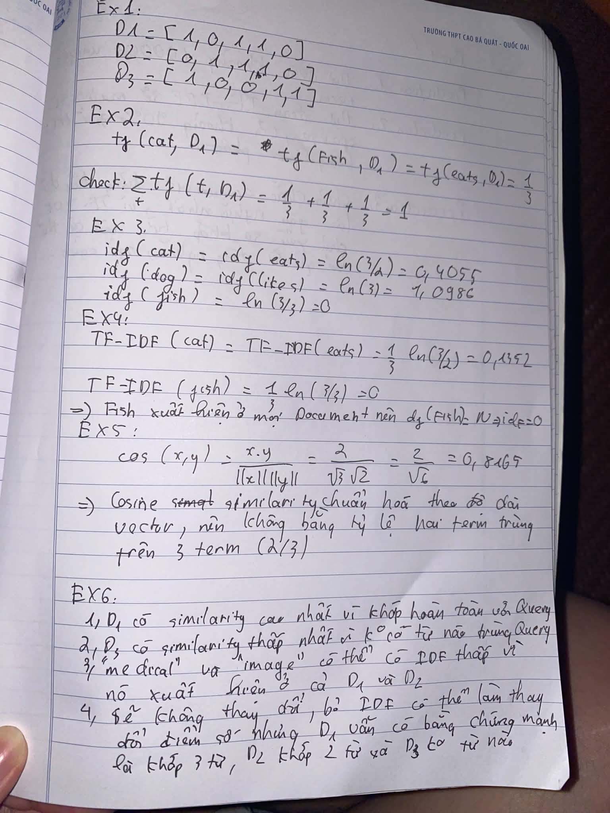

# 5. Part B — Calculation Exercises

Phần này phải được hoàn thành trước khi sử dụng code để kiểm tra kết quả.

## Exercise 1 — Count Vector

Cho corpus:

- D1 = `cat eats fish`
- D2 = `dog eats fish`
- D3 = `cat likes fish`

Vocabulary được sắp xếp theo thứ tự: `[cat, dog, eats, fish, likes]`.

Hãy tính count vector của D1, D2 và D3.

### Student answer

> TODO: Viết count vector của D1, D2 và D3.

## Exercise 2 — TF

Với D1 = `cat eats fish`, hãy tính:

- `tf(cat, D1)`
- `tf(eats, D1)`
- `tf(fish, D1)`

Kiểm tra: `sum_t tf(t, D1) = 1`.

### Student answer

> TODO: Viết các giá trị TF và kiểm tra tổng.

## Exercise 3 — IDF

Corpus có `N = 3` và:

- `df(cat) = 2`
- `df(dog) = 1`
- `df(eats) = 2`
- `df(fish) = 3`
- `df(likes) = 1`

Sử dụng `idf(t) = log(N / df(t))`, hãy tính IDF của từng term.

Sau đó trả lời: Term nào có IDF thấp nhất? Vì sao?

### Student answer

> TODO: Tính IDF của từng term và giải thích term có IDF thấp nhất.

## Exercise 4 — TF-IDF

Tính TF-IDF của D1 = `cat eats fish` cho cả ba term: `cat`, `eats`, `fish`.

Sau đó trả lời: Tại sao fish xuất hiện trong mọi document nhưng TF-IDF của nó bằng 0 theo công thức trên?

### Student answer

> TODO: Tính TF-IDF và giải thích.

## Exercise 5 — Cosine Similarity

Cho `x = [1, 1, 1]` và `y = [1, 1, 0]`. Tính `cos(x, y)`.

Sau đó giải thích bằng trực giác: Hai documents có hai term giống nhau trên ba term tổng cộng. Tại sao cosine similarity không bằng `2/3`?

### Student answer

> TODO: Tính cosine similarity và giải thích.

## Exercise 6 — Prediction

Cho:

- D1 = `medical image classification`
- D2 = `medical image analysis`
- D3 = `natural language processing`
- Query = `medical image classification`

Không dùng code, hãy dự đoán:

1. Document nào có similarity cao nhất?
2. Document nào có similarity thấp nhất?
3. Term nào có thể có giá trị IDF thấp?
4. Nếu bỏ IDF và chỉ sử dụng count vector thì ranking có thay đổi không?

### Student answer

> TODO: Viết prediction trước khi chạy experiment.

