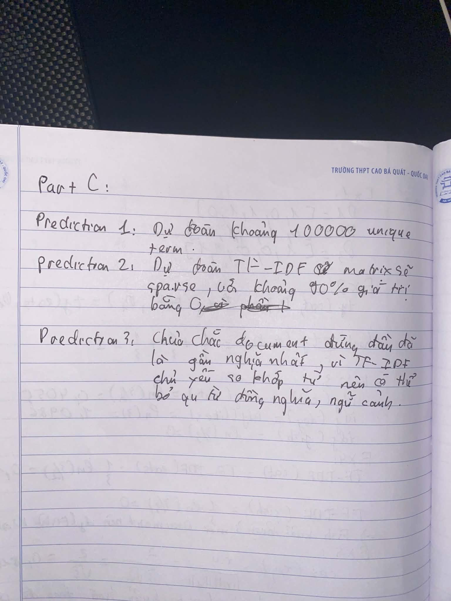

# 6. Part C — Prediction Before Experiment

Trước khi mở corpus 30K documents, ghi ít nhất ba prediction.

## Prediction 1 — Vocabulary

Nếu corpus có 30K documents, vocabulary sẽ có khoảng bao nhiêu unique terms?

## Prediction 2 — Sparsity

TF-IDF matrix sẽ dense hay sparse? Tỷ lệ zero entries có thể lớn đến mức nào?

## Prediction 3 — Search

Với một query bất kỳ, các documents đứng đầu kết quả tìm kiếm có nhất thiết là documents gần nghĩa nhất không?

### Bài làm

